# translationCore AI Bridge - Detailed Product Documentation

**Production line:** v0.6.6  
**Documentation date:** 13 August 2026  

> AI prepares, analyzes, proposes, explains, prioritizes, and gathers evidence. Human reviewers decide, edit Scripture, resolve disputes, and give final approval.

## 1. Product purpose and operating principle
For the complete formatted section, screenshots, tables, and workflow details, open [`index.html`](index.html#overview).

## 2. How the product works
For the complete formatted section, screenshots, tables, and workflow details, open [`index.html`](index.html#architecture).

## 3. Installation and first start
For the complete formatted section, screenshots, tables, and workflow details, open [`index.html`](index.html#install).

## 4. Dashboard - project analysis and exception-first review
For the complete formatted section, screenshots, tables, and workflow details, open [`index.html`](index.html#dashboard).

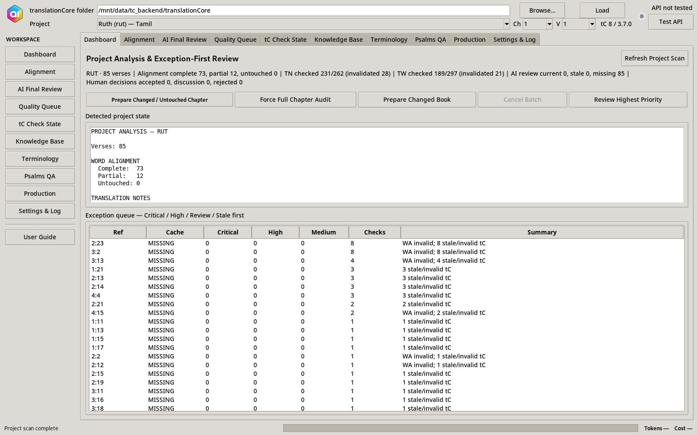

## 5. Alignment workspace
For the complete formatted section, screenshots, tables, and workflow details, open [`index.html`](index.html#alignment).

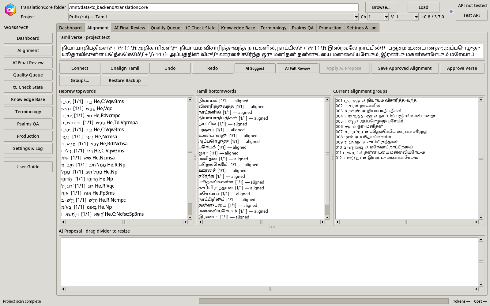

## 6. Responsive and small-screen behavior
For the complete formatted section, screenshots, tables, and workflow details, open [`index.html`](index.html#responsive).

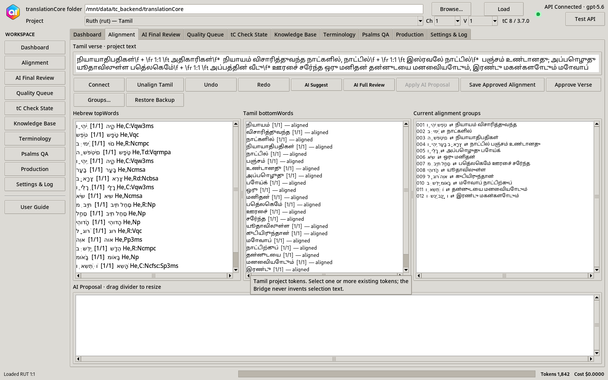

## 7. AI Final Review - evidence-backed verse review
For the complete formatted section, screenshots, tables, and workflow details, open [`index.html`](index.html#ai-review).

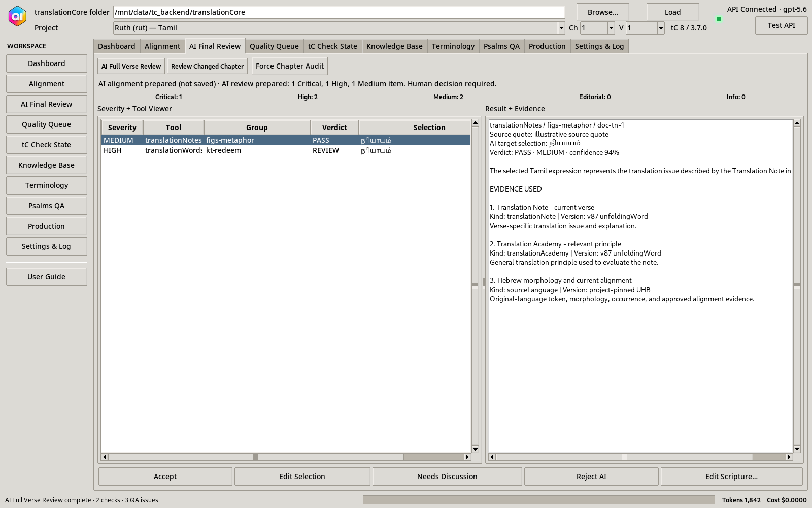

## 8. Quality Queue and human finding decisions
For the complete formatted section, screenshots, tables, and workflow details, open [`index.html`](index.html#quality).

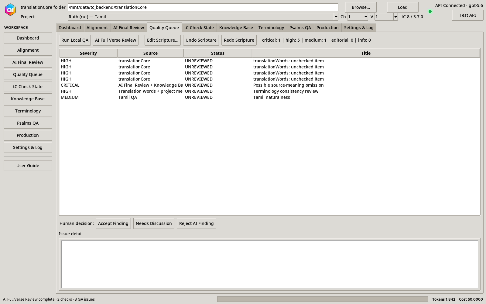

## 9. translationCore check state
For the complete formatted section, screenshots, tables, and workflow details, open [`index.html`](index.html#tc-state).

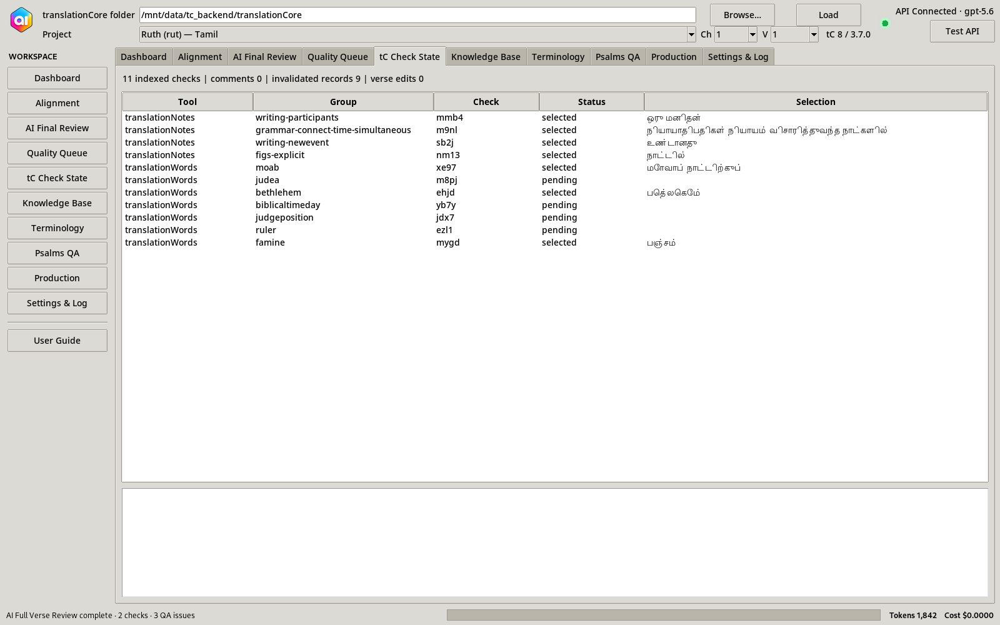

## 10. Knowledge Base and evidence provenance
For the complete formatted section, screenshots, tables, and workflow details, open [`index.html`](index.html#kb).

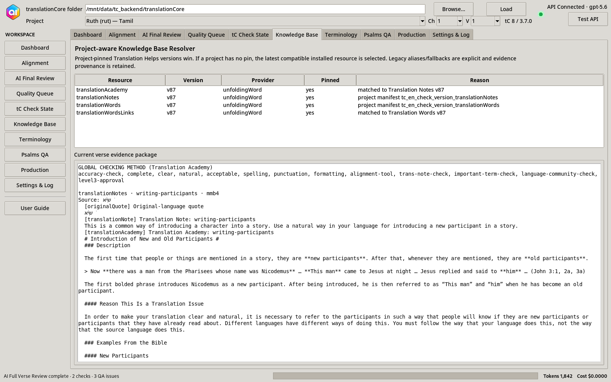

## 11. Terminology Decision Center and book analytics
For the complete formatted section, screenshots, tables, and workflow details, open [`index.html`](index.html#terminology).

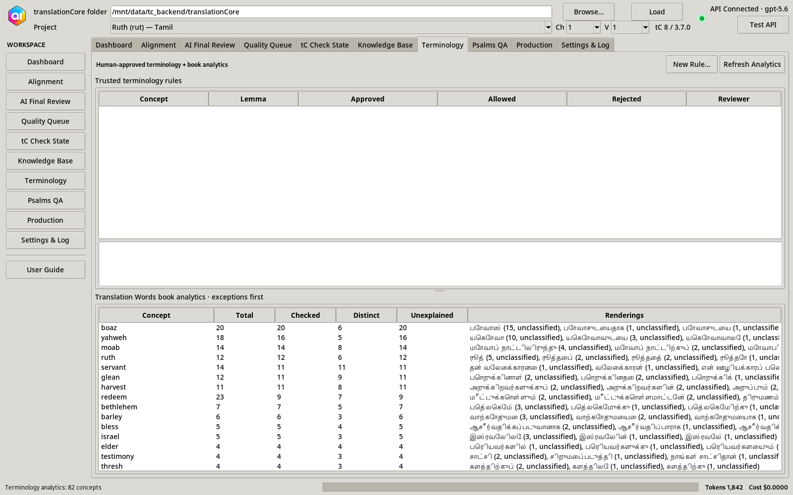

## 12. Psalms Structure & Parallelism QA
For the complete formatted section, screenshots, tables, and workflow details, open [`index.html`](index.html#psalms).

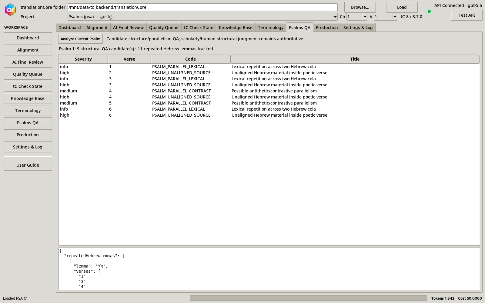

## 13. Production workspace
For the complete formatted section, screenshots, tables, and workflow details, open [`index.html`](index.html#production).

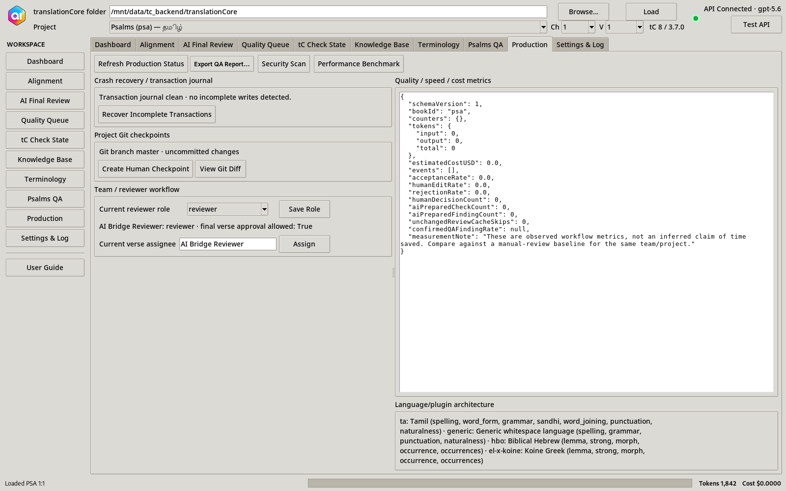

## 14. Settings, security, model routing and logs
For the complete formatted section, screenshots, tables, and workflow details, open [`index.html`](index.html#settings).

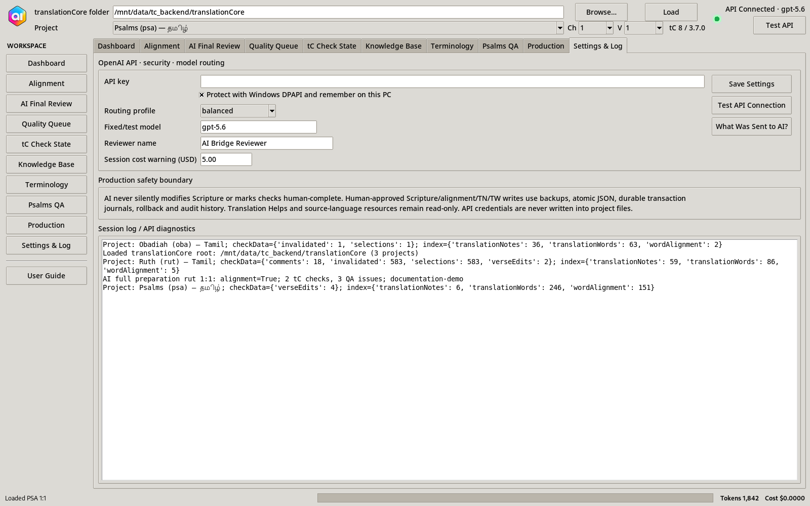

## 15. End-to-end product use cases
For the complete formatted section, screenshots, tables, and workflow details, open [`index.html`](index.html#usecases).

## 16. What the product reads and writes
For the complete formatted section, screenshots, tables, and workflow details, open [`index.html`](index.html#writes).

## 17. Changed-only dependency engine, cache and model cost
For the complete formatted section, screenshots, tables, and workflow details, open [`index.html`](index.html#cache).

## 18. Status, states and reviewer interpretation
For the complete formatted section, screenshots, tables, and workflow details, open [`index.html`](index.html#status).

## 19. Reports and publication QA
For the complete formatted section, screenshots, tables, and workflow details, open [`index.html`](index.html#reporting).

## 20. Troubleshooting and safe operating practices
For the complete formatted section, screenshots, tables, and workflow details, open [`index.html`](index.html#troubleshooting).

## 21. Measuring whether the product is helping
For the complete formatted section, screenshots, tables, and workflow details, open [`index.html`](index.html#metrics).

## 22. Branding and future-release logo
For the complete formatted section, screenshots, tables, and workflow details, open [`index.html`](index.html#brand).

## 23. Module reference
For the complete formatted section, screenshots, tables, and workflow details, open [`index.html`](index.html#appendix).
